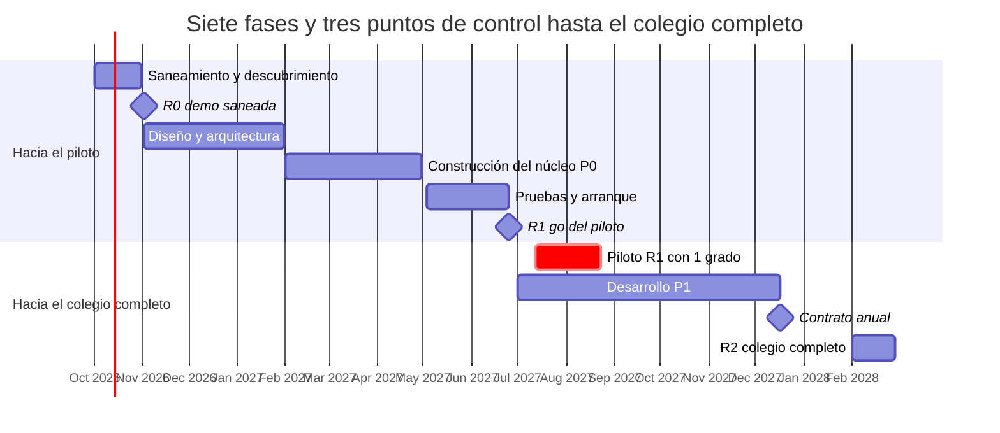

# Cronograma, ruta crítica y riesgos — MIDUHO

**Propósito:** ubicar las fases en el tiempo, la ruta crítica y los riesgos del plan.
**Fecha:** 2026-09-26
**Fuente:** [auditoría de producto](../auditoria-producto-2026-09-26.md), bóveda Obsidian (HU, RN, RNF), `docs/arquitectura-backend.md`.
**Convenciones:** IDs, prioridades, días y estados según el [índice del plan](README.md#cómo-usar-este-plan).

---

Con una sola persona a tiempo completo, el P0 previo al piloto suma ~166 días y llena todos los días hábiles entre el 1 de octubre de 2026 y el 25 de junio de 2027, descontando festivos y tres semanas de vacaciones de fin de año. El piloto cabe en julio de 2027, pero sin colchón; la auditoría estimó solo el desarrollo y este plan cubre todo el ciclo de vida.

La primera sección es secuencial; en la segunda, el desarrollo P1 corre en paralelo al piloto y debe terminar antes de firmar el contrato anual. Las fechas son objetivos 🔶, no compromisos.

| Fase | Fechas | Qué deja | Punto de control al cerrar |
| --- | --- | --- | --- |
| Saneamiento y descubrimiento | oct 2026 | Demo sin riesgo legal y requisitos v1 | R0 · demo saneada: sin riesgo legal |
| Diseño y arquitectura | nov 2026 – ene 2027 | Prototipos validados, CI, acceso y datos | — |
| Construcción del núcleo P0 | feb – abr 2027 | La clase y la biblioteca funcionando | — |
| Pruebas y arranque | may – jun 2027 | Carga de 400 probada, contenido cargado | R1 · go del piloto: carga de 400 ok y contratos firmados |
| Piloto R1 · 1 grado | jul – ago 2027 | 6 semanas de uso real | — |
| Desarrollo P1 | jul – dic 2027 | Actividades, asistencia, comunicación y notas | Contrato anual: piloto aprobado (PIL-10) |
| R2 · colegio completo | feb 2028 | ~400 usuarios en la plataforma | — |

**Ruta crítica:** F0-16 → ARQ-01 → ARQ-03 → ARQ-06 → ARQ-07 → IMP-ACA-06 → IMP-CLA-06 → IMP-BIB-06 → QA-06 → PIL-04 → PIL-07. Cada día perdido en esa cadena corre la fecha del piloto.

**Dependencias que no controlas:** la autorización de Maguaré (F0-03), el SIEE (DSC-02), el abogado (LEG-01), el contenido del colegio (DSC-11) y el plazo de los costos educativos (COM-04).

| Riesgo | Efecto si ocurre | Mitigación | Tareas |
| --- | --- | --- | --- |
| Una sola persona sin colchón: el P0 llena todos los días hábiles hasta junio de 2027 | El piloto se corre al período 3 (agosto–septiembre de 2027) | Sumar una segunda persona al 50 % desde enero para diseño y pruebas (~42 días P0), o reducir el alcance del piloto | UX, QA |
| El SIEE no llega a tiempo | Se bloquea la evaluación y con ella R2 | Pedirlo en la reunión de arranque; plan B: exportar al sistema actual del colegio | DSC-02, IMP-EVA-06 |
| Maguaré no autoriza las obras | Biblioteca del piloto con menos títulos | Catálogo de dominio público y CC BY, más las licencias que ya tenga el colegio | F0-03, LEG-11 |
| El contenido del piloto no está cargado | Se repite el aula vacía de la referencia | Inventario temprano y carga antes de liberar | DSC-11, PIL-04 |
| El internet del colegio es peor de lo supuesto | Libros y páginas lentos en el aula | Medirlo en el descubrimiento, caché PWA y carga por ventana del lector | DSC-05, ARQ-19, QA-07 |
| Baja adopción docente | No hay caso de éxito para vender | Docentes en las pruebas de diseño, capacitación y acompañamiento en el aula | UX-14, PIL-05, PIL-08 |
| Incidente con datos de menores | Pérdida del contrato y posible sanción | Autorización en el servidor, pruebas de acceso denegado y protocolo de incidentes | QA-03, LEG-09 |
| El costo no entra en los costos educativos de 2028 | No hay forma de cobrar el primer año | Confirmar el plazo con rectoría antes de diciembre de 2026 🔶 | COM-04 |

---

[← Anterior](11-comercial-soporte.md) · [Índice](README.md)
